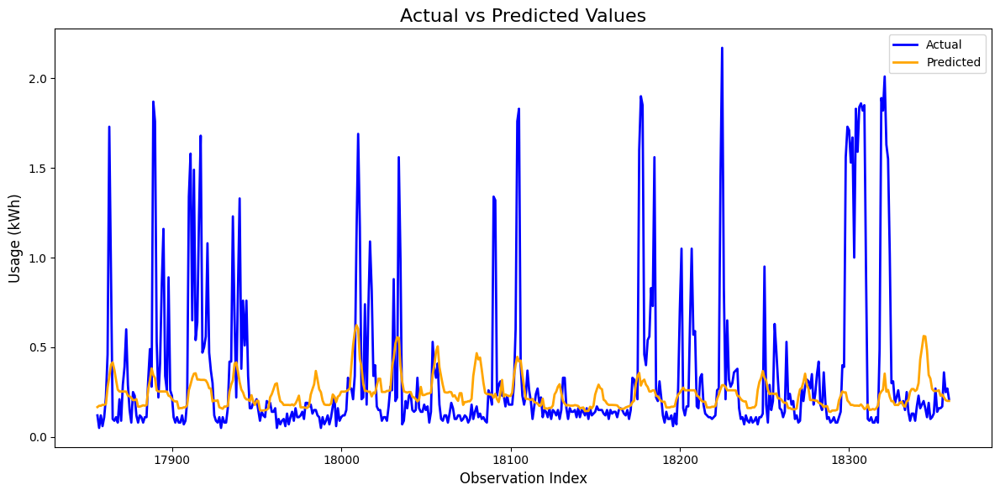

# Home Energy Project: Machine Learning for Energy Forecasting and Analysis

This project demonstrates a machine learning (ML) pipeline to analyze, forecast, and evaluate energy usage patterns in residential settings. Using personal energy usage data collected over multiple years, the project builds predictive models that could be extended for applications like **Measurement and Verification (M&V)** of energy savings or accurate energy/demand forecasting.

---

## **Project Objectives**
1. **Understand Energy Usage**:
   - Analyze historical energy consumption patterns using time-series data.
   - Incorporate external factors such as weather conditions to better understand variations in usage.

2. **Develop Predictive Models**:
   - Train machine learning models (e.g., LightGBM) to forecast energy usage, with a focus on capturing both regular patterns and rare usage spikes.

3. **Build a Scalable Framework**:
   - Create a generalizable pipeline that can be adapted for larger datasets or deployed for real-world objectives such as:
     - Guaranteed energy savings measurement (M&V).
     - Building energy demand forecasting for grid optimization.

---

## **Use Case: Guaranteed Energy Savings (M&V)**
This approach can serve as a foundation for Measurement and Verification (M&V) in energy savings projects. By accurately predicting baseline energy usage based on historical data and weather patterns:
- It becomes possible to quantify energy savings post-implementation of energy efficiency measures.
- This is critical for contractual agreements, such as performance-based energy savings contracts.

### **Why This Is Important**
M&V is a cornerstone of energy efficiency programs, ensuring that:
- Energy efficiency improvements deliver promised savings.
- Stakeholders (e.g., utilities, building owners) can trust the reported outcome

## Results

### **Key Metrics**
- **Root Mean Squared Logarithmic Error (RMSLE):** 0.15
  - Indicates the predicted values deviate, on average, by 15% on a logarithmic scale.
- **Total Energy Usage Deviation:** ~300 kWh (14%)
  - The predicted total energy usage for the test period was approximately 300 kWh lower than the actual usage.

### **Insights**
- The model captured the **timing** of energy usage peaks but struggled with **magnitude**, particularly during spikes.
- Predictions were more accurate for **lower energy usage values**.

### **Visualization**

- The plot shows actual vs. predicted energy usage for a three-week period.
- **Observation**: While the model aligns with the timing of peaks, the amplitude is often underestimated.

### **Limitations and Future Work**
- The current model does not fully capture usage spikes, which could be improved with more complex architectures (e.g., neural networks).
- The dataset reflects irregular usage patterns from a single residence, which adds variability.

## Repository Structure

- **Home_Energy_Project/**
  - **raw_data/**
    - Placeholder for raw data (e.g., energy usage, weather data)
  - **processed_data/**
    - Placeholder for processed datasets
  - **trained_model/**
    - Placeholder for trained model files
  - `DataPrepare.py`: Script for data preparation and feature engineering
  - `TrainingScript.py`: Script for training machine learning models
  - `PredictScript.py`: Script for making predictions and evaluating models
  - `config.py`: Centralized configuration for file paths
  - `README.md`: Project overview and instructions
