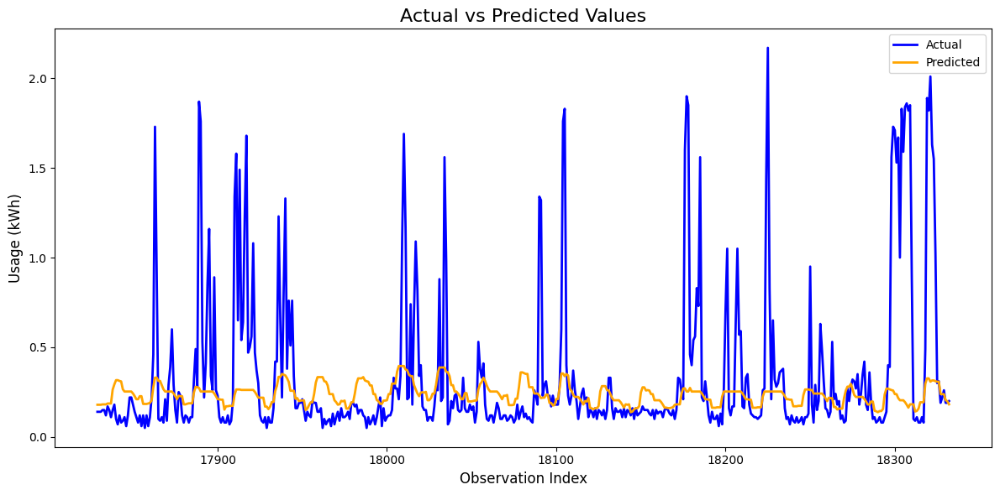

# Home Energy Project: Machine Learning for Energy Forecasting and Analysis

This project demonstrates a machine learning (ML) pipeline to analyze, forecast, and evaluate energy usage patterns in residential settings. Using personal energy usage data collected over multiple years, the project builds predictive models that could be extended for applications like **Measurement and Verification (M&V)** of energy savings or accurate energy/demand forecasting.

---

## **Project Objectives**
1. **Understand Energy Usage**:
   - Analyze historical energy consumption patterns using time-series data.
   - Incorporate external factors such as weather conditions to better understand variations in usage.

2. **Develop Predictive Models**:
   - Train machine learning models (e.g., LightGBM) to forecast energy usage, with a focus on capturing both regular patterns and rare usage spikes.

3. **Build a Scalable Framework**:
   - Create a generalizable pipeline that can be adapted for larger datasets or deployed for real-world objectives such as:
     - Guaranteed energy savings measurement (M&V).
     - Building energy demand forecasting for grid optimization.

---

## **Use Case: Guaranteed Energy Savings (M&V)**
This approach can serve as a foundation for Measurement and Verification (M&V) in energy savings projects. By accurately predicting baseline energy usage based on historical data and weather patterns:
- It becomes possible to quantify energy savings post-implementation of energy efficiency measures.
- This is critical for contractual agreements, such as performance-based energy savings contracts.

### **Why This Is Important**
M&V is a cornerstone of energy efficiency programs, ensuring that:
- Energy efficiency improvements deliver promised savings.
- Stakeholders (e.g., utilities, building owners) can trust the reported outcome

## Results

### **Key Metrics**
- **Root Mean Squared Logarithmic Error (RMSLE):** 0.15
  - Indicates the predicted values deviate, on average, by 15% on a logarithmic scale.
- **Total Energy Usage Deviation:** ~300 kWh (14%)
  - The predicted total energy usage for the test period was approximately 300 kWh lower than the actual usage.

### **Insights**
- The model captured the **timing** of energy usage peaks but struggled with **magnitude**, particularly during spikes.
- Predictions were more accurate for **lower energy usage values**.

### **Visualization**

- The plot shows actual vs. predicted energy usage for a three-week period.
- **Observation**: While the model aligns with the timing of peaks, the amplitude is often underestimated.

### **Limitations and Future Work**
The results of this exercise, while showing potential, fall short of being satisfactory from the perspective of an energy professional. A final evaluation of the predicted target variable against a year-long test dataset yielded an RMSLE of 0.15. The RMSLE indicates that, on average, the predicted values differ from the actual values by a factor of 15% on a logarithmic scale. The total predicted energy usage deviated from the actual usage by approximately 300 kWh, which represents a 14% difference from the actual total.

The predicted data successfully captured the timing of energy usage peaks but failed to match their magnitude. While this alignment with the timing of peaks may have some utility, it is highly desireable for the magnitude of the predictions to align closely with actual measurements. Additionally, the model performed well on lower values of energy usage but struggled to capture spikes.

#### Nature of the Dataset
The nature of the dataset itself could contribute to the challenges in modeling. This data represents my personal energy usage, which is influenced by my irregular schedule and the fact that I live alone. Patterns are often more systematic and easier to identify for commercial buildings or data aggregated from multiple buildings. My personal energy usage trends may be more random and less predictable. These factors introduce a high degree of variability, making it more difficult for the selected machine learning scheme to find consistent patterns or accurately predict usage.

#### Next Steps
The results could likely be improved by incorporating an ensemble of models, including neural networks, to better capture nonlinear relationships and complex patterns in the data.

If forecasting was the sole purpose of this excercise, then recursive forecasting could be implemented with potential to greatly increase model predictions. This process involves incorporating past observations of the target variable as a feature in model training.

In addition, historical forecasts could be integrated as a feature(s). Each observation of this feature would represent what the past forecast was according to a basis day. For example the 7-day historical temperature forecast would represent what the forecasted temperature was 7 days prior to each observation's current time.

#### Acknowledgements
I would like to extend my gratitude to VisualCrossing for providing academic-level access to their comprehensive weather database, which was instrumental in this project.

Additionally, I wish to thank the contributors of the Great Energy Predictor III competition for their innovative ideas and methodologies, which served as a valuable resource for approaching and solving this problem effectively.
## Repository Structure

- **Home_Energy_Project/**
  - **raw_data/**
    - Placeholder for raw data (e.g., energy usage, weather data)
  - **processed_data/**
    - Placeholder for processed datasets
  - **trained_model/**
    - Placeholder for trained model files
  - `fetch_raw_data.py`: Scrpit for retrieving datasets from Kaggle
  - `DataPrepare.py`: Script for data preparation and feature engineering
  - `TrainingScript.py`: Script for training machine learning models
  - `PredictScript.py`: Script for making predictions and evaluating models
  - `config.py`: Centralized configuration for file paths
  - `README.md`: Project overview and instructions
